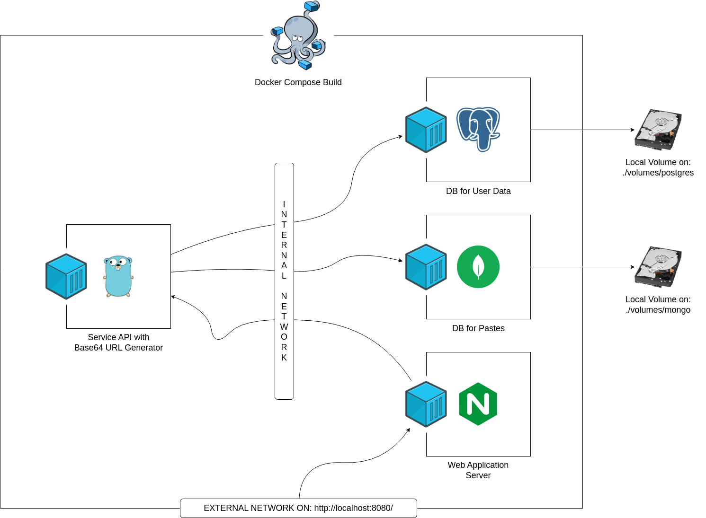

# Pastebin

Pastebin is a web application where anyone can store any text online for easy sharing.


*Pastebin Web Interface*


*Pastebin Architecture Diagram*

The maximum size a paste can be is 512 kilobytes (0.5 megabytes). This is should be enough for almost any piece of text or script, and it prevents people from jamming the backend servers. Loggined users can edit or delete anything they pasted and also allowed to create pastes up to 10 megabytes. Expired pastes will be removed permanently.

## Features

- The application can store text data up to 10 megabytes.
- The shorl URL address will be generated for paste after saving.
- When paste expires it will be removed automatically from the system.

## Prerequisites

- [Docker](https://docs.docker.com/desktop/linux/install/)

## Installation

Compile and run.

```
make
make run
```

## Testing

Run the unit-tests.

```
make test
```
